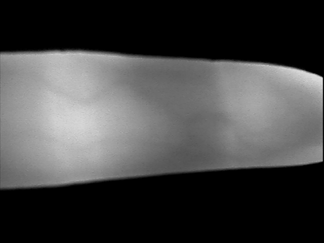
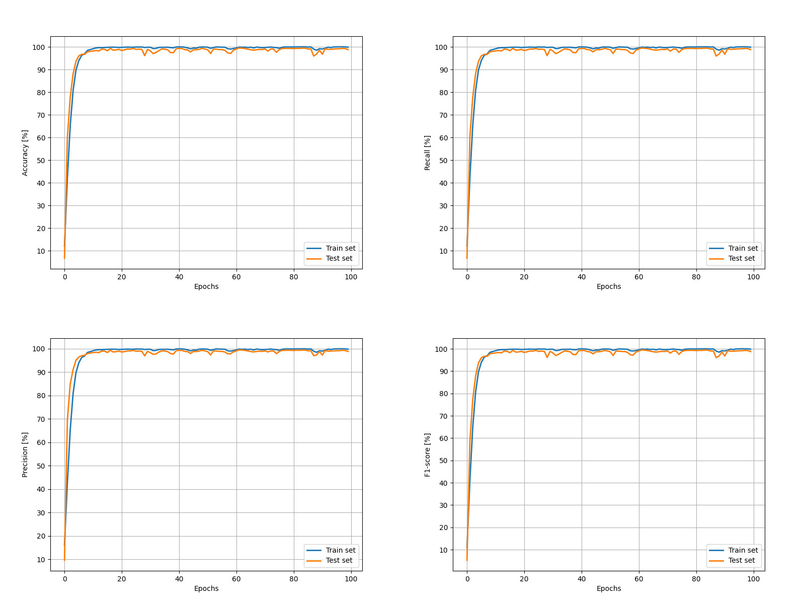

# Finger vein classification

This repository contains a part of project prepared for the research paper. I developed a convolutional neural network (CNN) model for the problem of finger vein classification. This model was trained on two publicly available datasets: SDUMLA-HMT (https://doi.org/10.1007/978-3-642-25449-9_33) and MMCBNU_6000 (10.1109/CISP.2013.6744030).

Example of image from MMCBNU_6000:

Due to the review process, the complete architecture cannot be published at this time. Consequently, the utilized data remains unprocessed, and the architecture presented here is not the final version. As a result, the achieved results may not represent the highest attainable performance.

In this project, I faced the challenge of working with very similar images, requiring a more complex architecture than what I had used in previous projects.

# Test set Results

Below are the results of the model on the test set:

